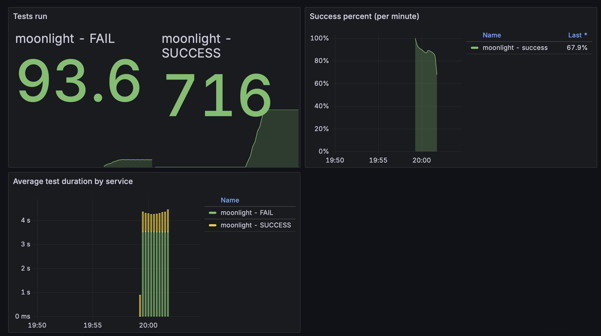
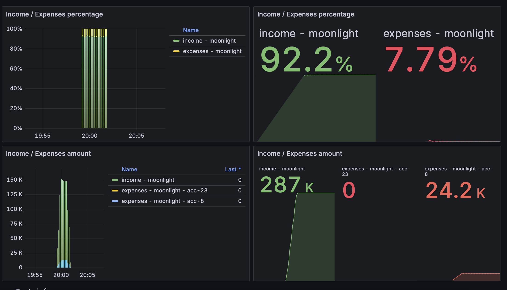
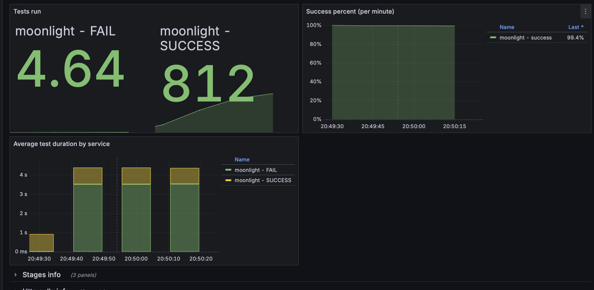
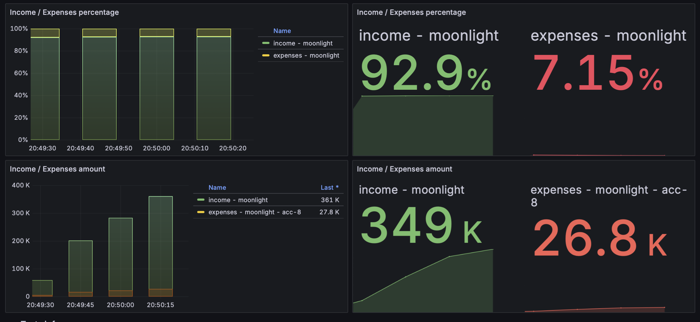

# Объяснение к Кейсу Номер 6

## Как у нас было до:

Обратили внимание на такие ошибки:
2025-10-26T13:13:59.108+03:00  WARN 2559 --- [sion-executor-2] r.q.p.l.PaymentExternalSystemAdapter     : [acc-8] Payment processed for txId: 4da23a80-9061-446f-91d1-394b46aab988, payment: 9c40bf22-7974-4042-9825-79738ec144e4, succeeded: false, message: Temporary error

Это проблема, связанная с текущим состоянием системы, которая может исчезнуть сама через какое-то время, поэтому мы решили использовать retry и попробовать заново отпраить запрос.

В классе PaymentExternalSystemAdapterImpl, реализовали механизм повторных попыток (Retry), который срабатывает, если:
- ответ пришёл, но результат неудачный (body.result == false)

Проверяем только три раза:
Если внешняя система реально лежит, то будет бесконечно ретраить, поэтому ограничиваем.

## Наши результы:

