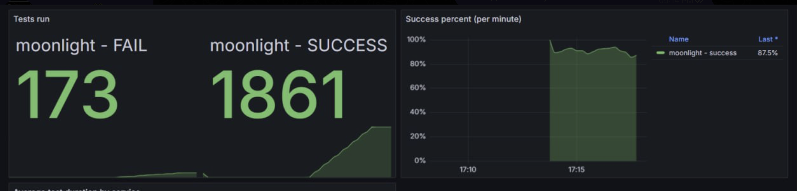
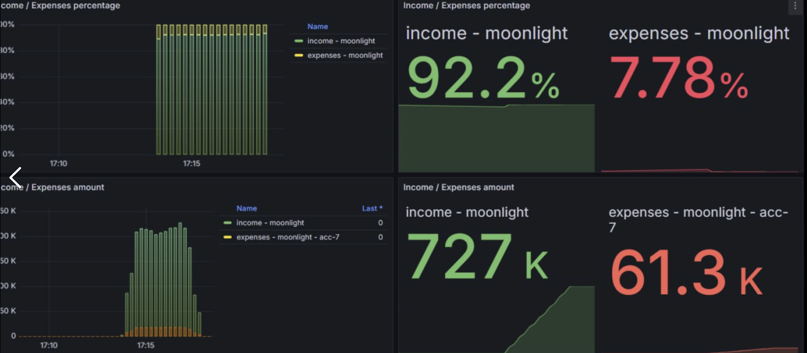
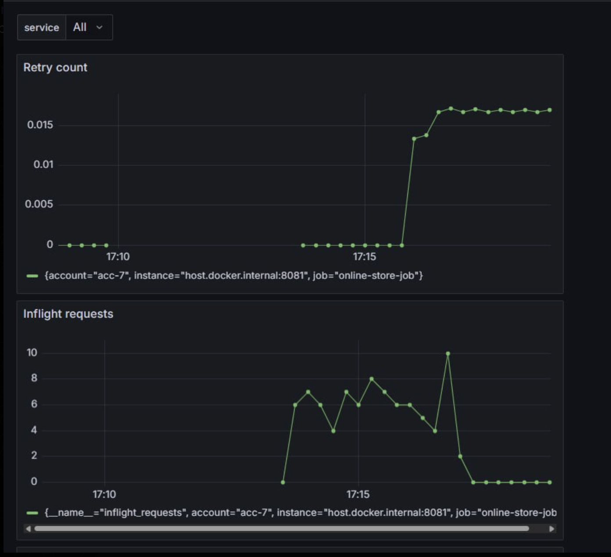
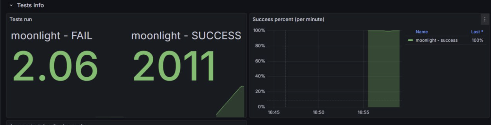
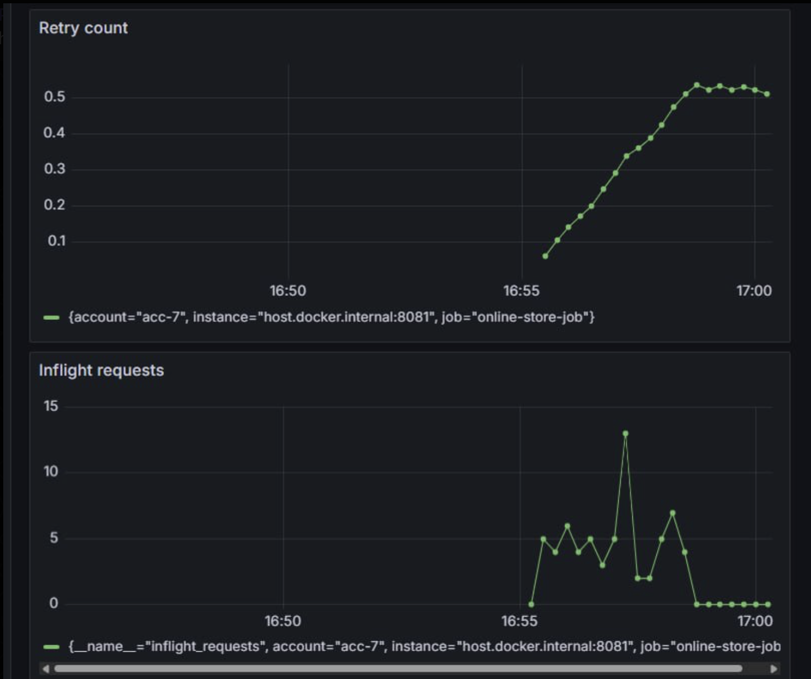
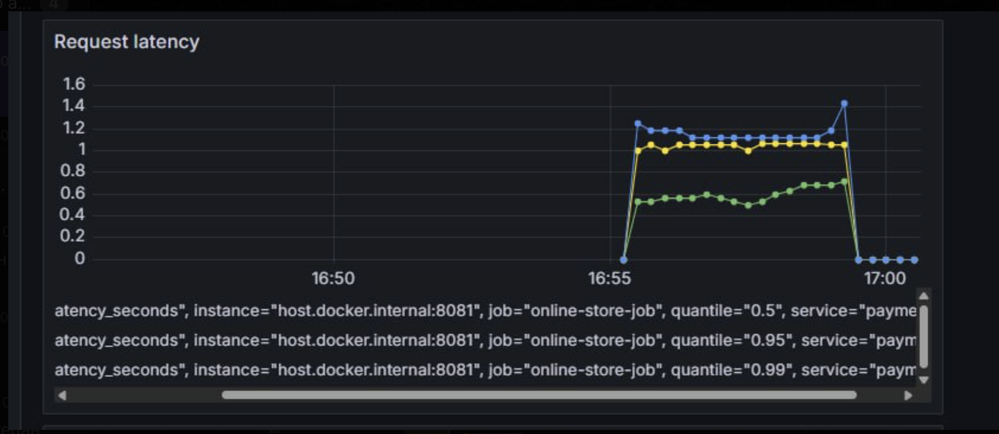

**Кейс 7**
---

## Как у нас было до:








**Файл:** `PaymentExternalSystemAdapterImpl.kt`

- `DistributionSummary` → для `payment_request_latency` с квантилями
- `Counter` → для `request`, `retry`, `success`, `failure`
- `MeterRegistry.gauge()` → для `inflight` запросов
---

### 2. Добавление метрик в класс

```kotlin
private val summary =  DistributionSummary
  .builder("request_latency_seconds")
  .tags("service", "payment")
  .publishPercentiles(0.5, 0.95, 0.99)
  .register(registry)

private val retryCounter = Counter
  .builder("payment_retry_count")
  .tag("account", accountName)
  .register(registry)

private val inflightGauge = Gauge
  .builder("inflight_requests", this) { adapter ->
    adapter.currentInflight.get().toDouble()
  }
  .tag("account", accountName)
  .register(registry)

private val currentInflight = AtomicInteger(0)
```
---
Зачем каждая из метрик?
1. inflight_requests Gauge

Показывает, сколько запросов одновременно в работе.
Если он начинает расти → значит: удерживается слишком много запросов

2. request_latency_seconds DistributionSummary
Максимально время задержки у N-процентов запросов.
---

3. payment_retry_count
Как быстро увеличивается количество retry-ев
---

## Как считали:
0.90  quantile(0.90) P90 времени ответа SLA ориентируется на хвост задержек, P90 — оптимальный сигнал для нагрузки
500 .coerceAtLeast(500L) Минимальный timeout (0.5s) Быстрее нельзя — иначе много ложных таймаутов
10_000 .coerceAtMost(10_000L) Максимальный timeout (10s) - Верхняя граница, чтобы не висеть бесконечно
200  remaining <= 200 Не начинаем запрос если осталось <200 мс

## Решение

**График который помог решить: DistributionSummary**
В 95 процентах реквестах - макс время ожидаение около 10 секунд

После исправления у 95 проентов реквестах стали обрабатываться за 1 секунду
Значит максимальное время обработки снизилось в 10 раз

**retryCounter**
До решения ретраи не шли сначала, а потом начали взлетать, то есть они накапливались - и пачкой потом обработывались
Могло кончится время на жизнь, а запрос не обработан

После решения: ретрай автоматом подстраивается, по чуть-чуть гарантируем, что они обрабаботаются, никакие запросы не будут пропадать

**Gauge**
Перед пиком ретраев - максимум потоков начало использоваться. Сначала все не ретвай, потом идет попытка расчитать
После решения: Пытаемся как можно больше всего, до пика ретраев

## Наши результы:





