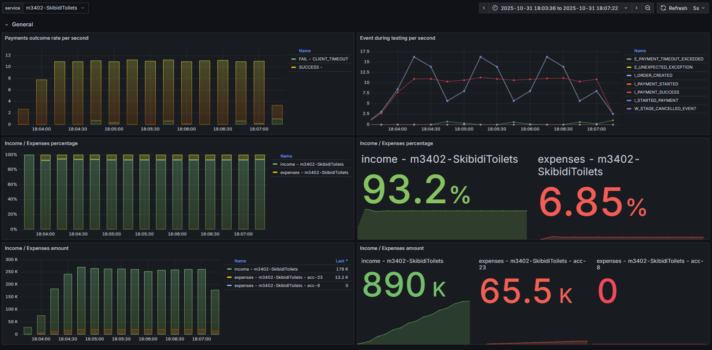
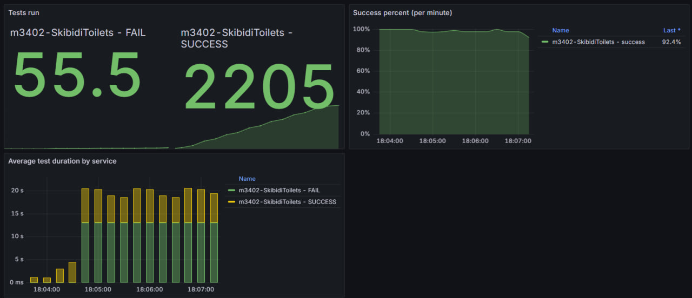
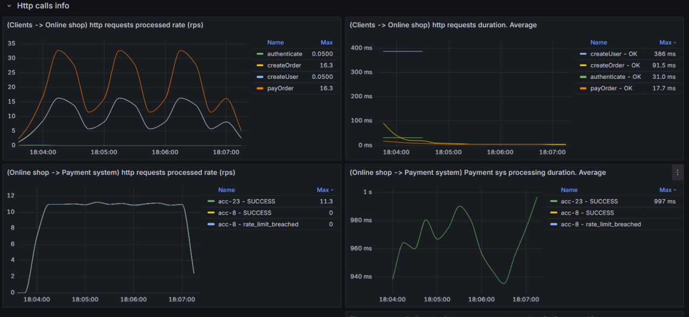

По графику `(Clients -> Online shop) http requests processed rate (rps)`
Видно, что нагрузка волнообразная => нужно её "выпрямить"
Для этого используем рейт-лимитер "дырявое ведро"

параметр `rate` - "скорость утечки" - выставляем 11, чтобы максимально использовать ресурс системы оплаты
параметр `bucketSize` - максимальное кол-во запросов, которое мы имеем право забуферизовать - примерно rateLimitPerSec ext. * processingTimeSec