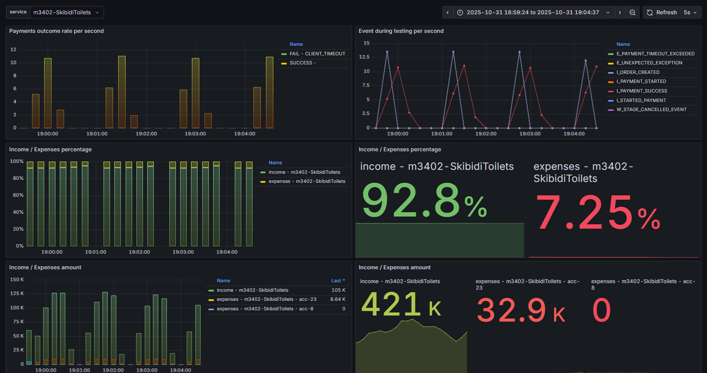
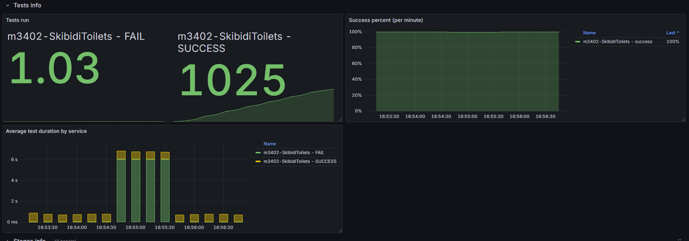
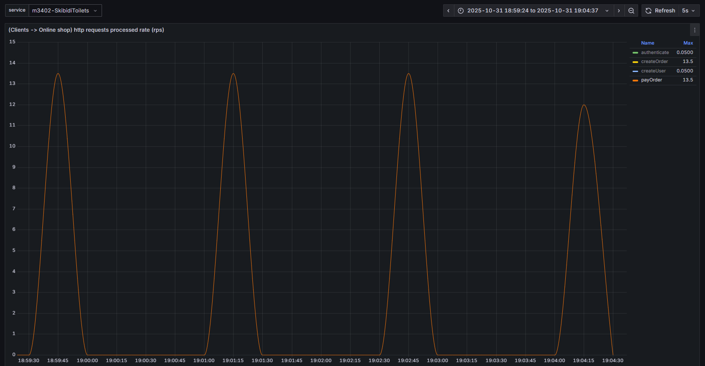
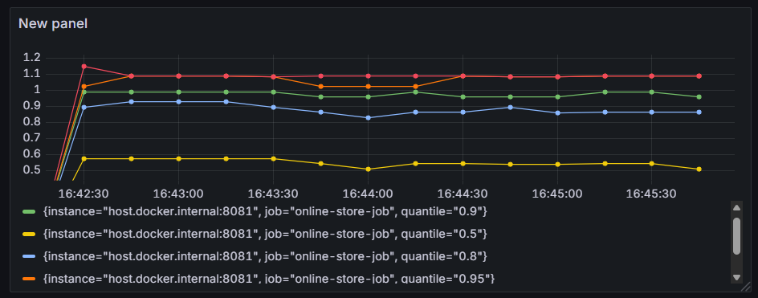

параметры системы оплаты:

PaymentAccountProperties(serviceName=m3402-SkibidiToilets, accountName=acc-7, parallelRequests=50, rateLimitPerSec=8, price=30, averageProcessingTime=PT1.2S, enabled=true)

Результаты:

График длительности запросов по перцентилям **ДО** добавления таймаута в OkHttpClient:

Видим что около 90% запросов выполняются менее чем за 1.2 секундры => неоптимальное использование ресурсов. Добавим в http клиент таймаут 1.5 с. Люой запрос, который исполняется более - прерываем и обрабатываем ошибку. Ретраим по возможности. 

График длительности запросов по перцентилям **ПОСЛЕ** добавления таймаута в OkHttpClient:

Все запросы исполняются менее чем за 1.2 секунды